# Vida Coach API Documentation

## Table of Contents
1. [Overview](#overview)
2. [Base URL](#base-url)
3. [Authentication](#authentication)
4. [API Route Structure](#api-route-structure)
5. [Core User Routes](#core-user-routes)
6. [Authentication Routes](#authentication-routes)
7. [Journal Management](#journal-management)
8. [AI & Coaching](#ai--coaching)
9. [Goals & Tasks](#goals--tasks)
10. [Health & Wellness](#health--wellness)
11. [Account Management](#account-management)
12. [Admin Routes](#admin-routes)
13. [System Routes](#system-routes)
14. [Error Handling](#error-handling)
15. [Rate Limiting](#rate-limiting)

## Overview

The Vida Coach API is a comprehensive backend system for a personal coaching and wellness application. It provides endpoints for user management, journaling, AI-powered coaching, goal tracking, health monitoring, and administrative functions.

**Version:** 1.0.0  
**Contact:** support@vidacoach.ai

## Base URL

```
http://localhost:8002
```

## Authentication

The API uses JWT (JSON Web Token) authentication. Include the token in the Authorization header:

```
Authorization: Bearer <your_jwt_token>
```

## API Route Structure

```
┌─────────────────────────────────────────────────────────────┐
│                    Vida Coach API                           │
├─────────────────────────────────────────────────────────────┤
│  /                                                          │
│  ├── /auth/                    # Authentication             │
│  ├── /users/                   # User Management            │
│  ├── /journal/                 # Journal Entries            │
│  ├── /ai/                      # AI Coaching                │
│  ├── /goals/                   # Goal Management            │
│  ├── /checkins/                # Health Check-ins           │
│  ├── /account/                 # Account Settings           │
│  ├── /admin/                   # Admin Functions            │
│  └── /health/                  # System Health              │
└─────────────────────────────────────────────────────────────┘
```

## Core User Routes

### User Management (`/users/`)

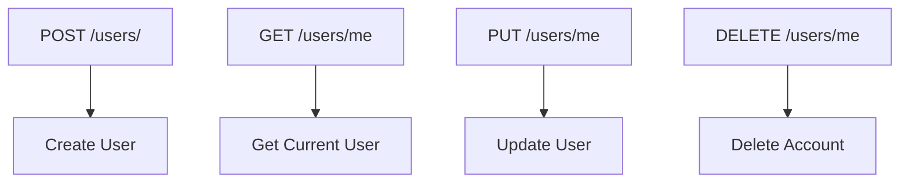

**Endpoints:**
- `POST /users/` - Create new user account
- `GET /users/me` - Get current user profile
- `PUT /users/me` - Update user profile
- `DELETE /users/me` - Delete user account

### Authentication (`/auth/`)

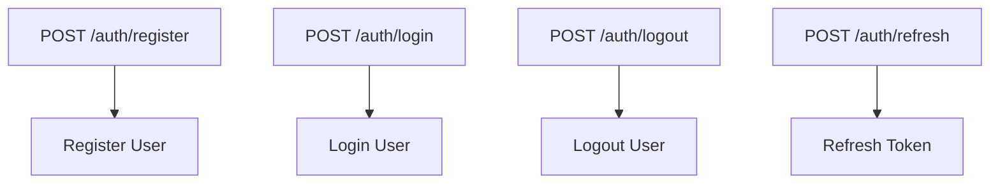

**Endpoints:**
- `POST /auth/register` - Register new user (supports optional `role` for admin signup)
- `POST /auth/login` - User login
- `POST /auth/logout` - User logout
- `POST /auth/refresh` - Refresh access token

## Journal Management

### Journal Entries (`/journal/`)

```mermaid
graph TD
    A[POST /journal/] --> B[Create Entry]
    C[GET /journal/] --> D[List Entries]
    E[GET /journal/{id}] --> F[Get Entry]
    G[PUT /journal/{id}] --> H[Update Entry]
    I[DELETE /journal/{id}] --> J[Delete Entry]
    K[GET /journal/export] --> L[Export Journals]
```

**Endpoints:**
- `POST /journal/` - Create journal entry
- `GET /journal/` - List user's journal entries
- `GET /journal/{id}` - Get specific journal entry
- `PUT /journal/{id}` - Update journal entry
- `DELETE /journal/{id}` - Delete journal entry
- `GET /journal/export` - Export journals to PDF

### Journal Summaries (`/journal-summary/`)

```mermaid
graph TD
    A[POST /journal-summary/] --> B[Generate Summary]
    C[GET /journal-summary/] --> D[List Summaries]
    E[GET /journal-summary/{id}] --> F[Get Summary]
    G[POST /journal-summary/{id}/feedback] --> H[Submit Feedback]
```

**Endpoints:**
- `POST /journal-summary/` - Generate AI summary
- `GET /journal-summary/` - List summaries
- `GET /journal-summary/{id}` - Get specific summary
- `POST /journal-summary/{id}/feedback` - Submit feedback

### Journal Trends (`/journal-trends/`)

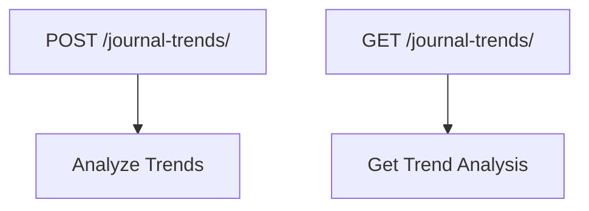

**Endpoints:**
- `POST /journal-trends/` - Analyze journal trends
- `GET /journal-trends/` - Get trend analysis

## AI & Coaching

### AI Coach (`/ai/`)

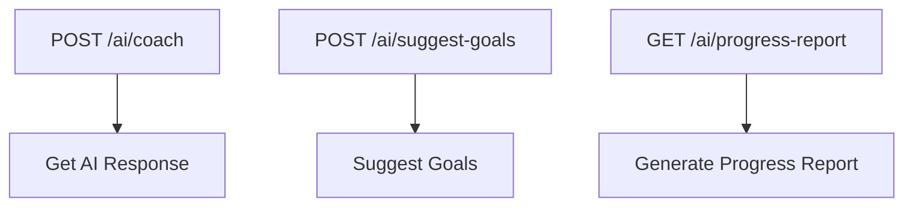

**Endpoints:**
- `POST /ai/coach` - Get AI coaching response
- `POST /ai/suggest-goals` - Get goal suggestions
- `GET /ai/progress-report` - Generate progress report

### Orchestration (`/orchestration/`)

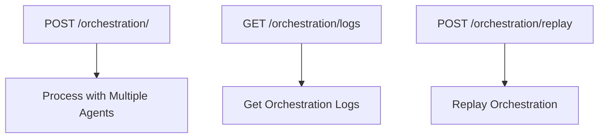

**Endpoints:**
- `POST /orchestration/` - Process with multiple AI agents
- `GET /orchestration/logs` - Get orchestration logs
- `POST /orchestration/replay` - Replay orchestration

## Goals & Tasks

### Goals (`/goals/`)

```mermaid
graph TD
    A[POST /goals/] --> B[Create Goal]
    C[GET /goals/] --> D[List Goals]
    E[GET /goals/{id}] --> F[Get Goal]
    G[PUT /goals/{id}] --> H[Update Goal]
    I[DELETE /goals/{id}] --> J[Delete Goal]
```

**Endpoints:**
- `POST /goals/` - Create new goal
- `GET /goals/` - List user's goals
- `GET /goals/{id}` - Get specific goal
- `PUT /goals/{id}` - Update goal
- `DELETE /goals/{id}` - Delete goal

### Tasks (`/tasks/`)

```mermaid
graph TD
    A[POST /tasks/] --> B[Create Task]
    C[GET /tasks/] --> D[List Tasks]
    E[PUT /tasks/{id}/complete] --> F[Complete Task]
    G[DELETE /tasks/{id}] --> H[Delete Task]
```

**Endpoints:**
- `POST /tasks/` - Create new task
- `GET /tasks/` - List user's tasks
- `PUT /tasks/{id}/complete` - Mark task as complete
- `DELETE /tasks/{id}` - Delete task

### Action Plans (`/action-plans/`)

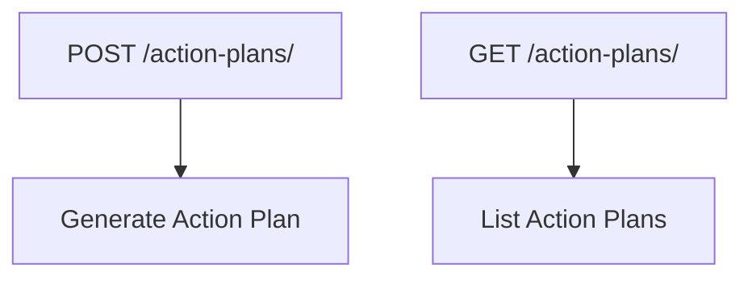

**Endpoints:**
- `POST /action-plans/` - Generate action plan
- `GET /action-plans/` - List action plans

## Health & Wellness

### Daily Check-ins (`/checkins/`)

```mermaid
graph TD
    A[POST /checkins/] --> B[Submit Check-in]
    C[GET /checkins/] --> D[List Check-ins]
    E[GET /checkins/{id}] --> F[Get Check-in]
```

**Endpoints:**
- `POST /checkins/` - Submit daily check-in
- `GET /checkins/` - List check-ins
- `GET /checkins/{id}` - Get specific check-in

### Habit Sync (`/habit-sync/`)

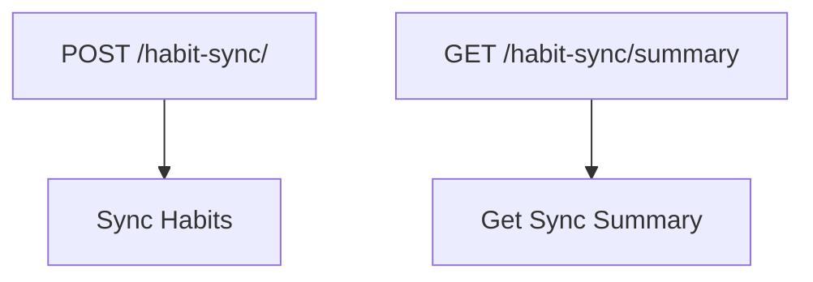

**Endpoints:**
- `POST /habit-sync/` - Sync habit data
- `GET /habit-sync/summary` - Get sync summary

### Wearable Integration (`/wearables/`)

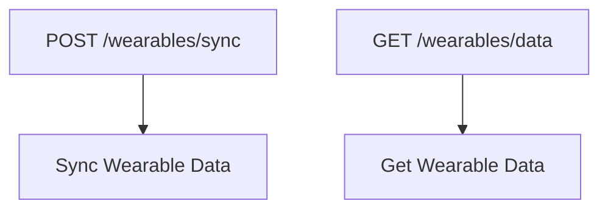

**Endpoints:**
- `POST /wearables/sync` - Sync wearable data
- `GET /wearables/data` - Get wearable data

## Account Management

### Account Settings (`/account/`)

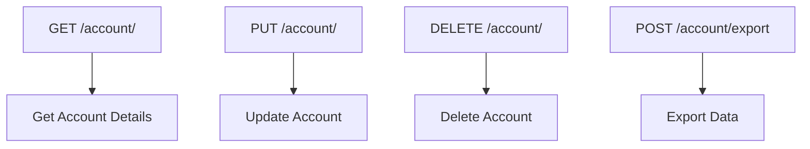

**Endpoints:**
- `GET /account/` - Get account details
- `PUT /account/` - Update account settings
- `DELETE /account/` - Delete account
- `POST /account/export` - Export user data

### Personalization (`/account/personalization/`)

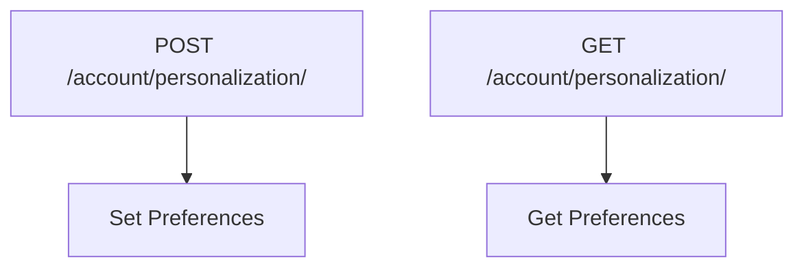

**Endpoints:**
- `POST /account/personalization/` - Set personalization preferences
- `GET /account/personalization/` - Get personalization preferences

### Billing (`/billing/`)

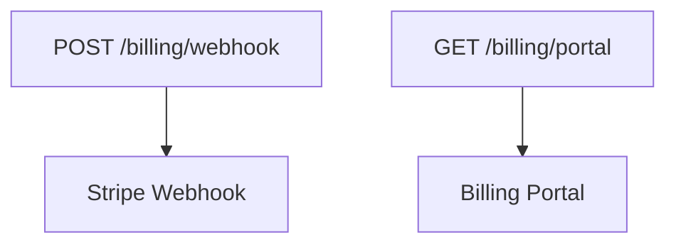

**Endpoints:**
- `POST /billing/webhook` - Stripe webhook handler
- `GET /billing/portal` - Billing portal access

## Admin Routes

### User Management (`/admin/users/`)

```mermaid
graph TD
    A[GET /admin/users/] --> B[List All Users]
    C[GET /admin/users/{id}] --> D[Get User Details]
    E[PUT /admin/users/{id}] --> F[Update User]
    G[POST /admin/impersonation] --> H[Impersonate User]
```

**Endpoints:**
- `GET /admin/users/` - List all users
- `GET /admin/users/{id}` - Get user details
- `PUT /admin/users/{id}` - Update user
- `POST /admin/impersonation` - Impersonate user

### Agent Management (`/admin/agents/`)

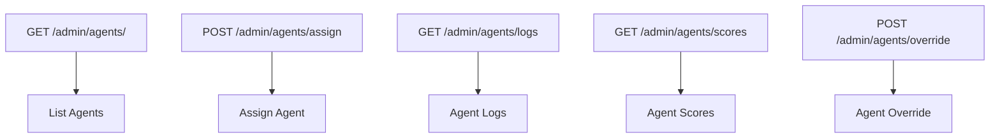

**Endpoints:**
- `GET /admin/agents/` - List AI agents
- `POST /admin/agents/assign` - Assign agent to user
- `GET /admin/agents/logs` - Get agent execution logs
- `GET /admin/agents/scores` - Get agent performance scores
- `POST /admin/agents/override` - Override agent behavior

### Analytics (`/admin/analytics/`)

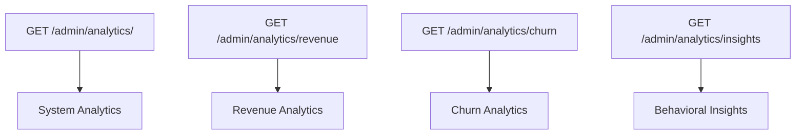

**Endpoints:**
- `GET /admin/analytics/` - System analytics
- `GET /admin/analytics/revenue` - Revenue analytics
- `GET /admin/analytics/churn` - Churn risk analytics
- `GET /admin/analytics/insights` - Behavioral insights

### Content Management (`/admin/content/`)

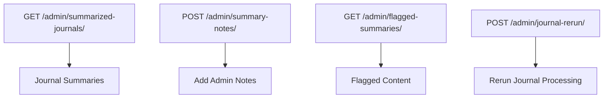

**Endpoints:**
- `GET /admin/summarized-journals/` - List journal summaries
- `POST /admin/summary-notes/` - Add admin notes
- `GET /admin/flagged-summaries/` - List flagged content
- `POST /admin/journal-rerun/` - Rerun journal processing

### System Management (`/admin/system/`)

```mermaid
graph TD
    A[GET /admin/system/status] --> B[System Status]
    C[GET /admin/system/metrics] --> D[System Metrics]
    E[GET /admin/system/logs] --> F[System Logs]
    G[POST /admin/features/] --> H[Feature Toggles]
```

**Endpoints:**
- `GET /admin/system/status` - System status
- `GET /admin/system/metrics` - System metrics
- `GET /admin/system/logs` - System logs
- `POST /admin/features/` - Feature toggles

## System Routes

### Health (`/health/`)

```mermaid
graph TD
    A[GET /health/ping] --> B[Health Check]
    C[GET /health/version] --> D[Version Info]
```

**Endpoints:**
- `GET /health/ping` - Health check
- `GET /health/version` - Version information

### Settings (`/settings/`)

```mermaid
graph TD
    A[GET /settings/enabled-features] --> B[Enabled Features]
```

**Endpoints:**
- `GET /settings/enabled-features` - Get enabled features

### Feedback (`/feedback/`)

```mermaid
graph TD
    A[POST /feedback/] --> B[Submit Feedback]
    C[GET /feedback/] --> D[List Feedback]
```

**Endpoints:**
- `POST /feedback/` - Submit feedback
- `GET /feedback/` - List feedback (admin only)

## Error Handling

The API uses standard HTTP status codes:

- `200` - Success
- `201` - Created
- `400` - Bad Request
- `401` - Unauthorized
- `403` - Forbidden
- `404` - Not Found
- `422` - Validation Error
- `429` - Rate Limited
- `500` - Internal Server Error

## Rate Limiting

The API implements rate limiting to prevent abuse:

- **Default:** 100 requests per minute per IP
- **Testing:** Rate limiting is disabled when `TESTING=true`

## Complete Route Map

```
Vida Coach API Routes
├── Authentication & Users
│   ├── POST   /auth/register
│   ├── POST   /auth/login
│   ├── POST   /auth/logout
│   ├── POST   /auth/refresh
│   ├── POST   /users/
│   ├── GET    /users/me
│   ├── PUT    /users/me
│   └── DELETE /users/me
│
├── Journal Management
│   ├── POST   /journal/
│   ├── GET    /journal/
│   ├── GET    /journal/{id}
│   ├── PUT    /journal/{id}
│   ├── DELETE /journal/{id}
│   ├── GET    /journal/export
│   ├── POST   /journal-summary/
│   ├── GET    /journal-summary/
│   ├── GET    /journal-summary/{id}
│   ├── POST   /journal-summary/{id}/feedback
│   ├── POST   /journal-trends/
│   └── GET    /journal-trends/
│
├── AI & Coaching
│   ├── POST   /ai/coach
│   ├── POST   /ai/suggest-goals
│   ├── GET    /ai/progress-report
│   ├── POST   /orchestration/
│   ├── GET    /orchestration/logs
│   └── POST   /orchestration/replay
│
├── Goals & Tasks
│   ├── POST   /goals/
│   ├── GET    /goals/
│   ├── GET    /goals/{id}
│   ├── PUT    /goals/{id}
│   ├── DELETE /goals/{id}
│   ├── POST   /tasks/
│   ├── GET    /tasks/
│   ├── PUT    /tasks/{id}/complete
│   ├── DELETE /tasks/{id}
│   ├── POST   /action-plans/
│   └── GET    /action-plans/
│
├── Health & Wellness
│   ├── POST   /checkins/
│   ├── GET    /checkins/
│   ├── GET    /checkins/{id}
│   ├── POST   /habit-sync/
│   ├── GET    /habit-sync/summary
│   ├── POST   /wearables/sync
│   └── GET    /wearables/data
│
├── Account Management
│   ├── GET    /account/
│   ├── PUT    /account/
│   ├── DELETE /account/
│   ├── POST   /account/export
│   ├── POST   /account/personalization/
│   ├── GET    /account/personalization/
│   ├── POST   /billing/webhook
│   └── GET    /billing/portal
│
├── Admin Routes
│   ├── GET    /admin/users/
│   ├── GET    /admin/users/{id}
│   ├── PUT    /admin/users/{id}
│   ├── POST   /admin/impersonation
│   ├── GET    /admin/agents/
│   ├── POST   /admin/agents/assign
│   ├── GET    /admin/agents/logs
│   ├── GET    /admin/agents/scores
│   ├── POST   /admin/agents/override
│   ├── GET    /admin/analytics/
│   ├── GET    /admin/analytics/revenue
│   ├── GET    /admin/analytics/churn
│   ├── GET    /admin/analytics/insights
│   ├── GET    /admin/summarized-journals/
│   ├── POST   /admin/summary-notes/
│   ├── GET    /admin/flagged-summaries/
│   ├── POST   /admin/journal-rerun/
│   ├── GET    /admin/system/status
│   ├── GET    /admin/system/metrics
│   ├── GET    /admin/system/logs
│   └── POST   /admin/features/
│
└── System Routes
    ├── GET    /health/ping
    ├── GET    /health/version
    ├── GET    /settings/enabled-features
    ├── POST   /feedback/
    └── GET    /feedback/
```

## Testing the API

You can test the API using:

1. **Interactive Documentation:** Visit `http://localhost:8002/docs`
2. **Alternative Docs:** Visit `http://localhost:8002/redoc`
3. **OpenAPI Schema:** Visit `http://localhost:8002/openapi.json`

## Environment Variables

Required environment variables for running the API:

```bash
DATABASE_URL=sqlite:///./test.db
OPENAI_API_KEY=your_openai_key
STRIPE_SECRET_KEY=your_stripe_key
STRIPE_WEBHOOK_SECRET=your_webhook_secret
SECRET_KEY=your_secret_key
RATE_LIMIT=100/minute
```

## Support

For API support, contact: support@vidacoach.ai

---

*This documentation was generated for Vida Coach API v1.0.0* 