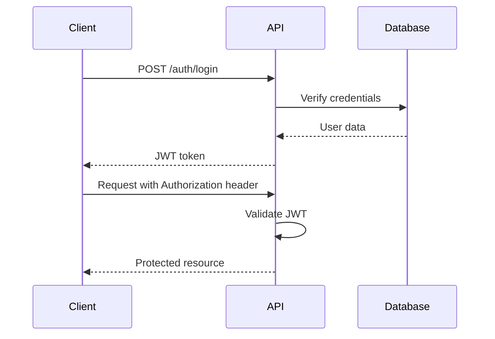
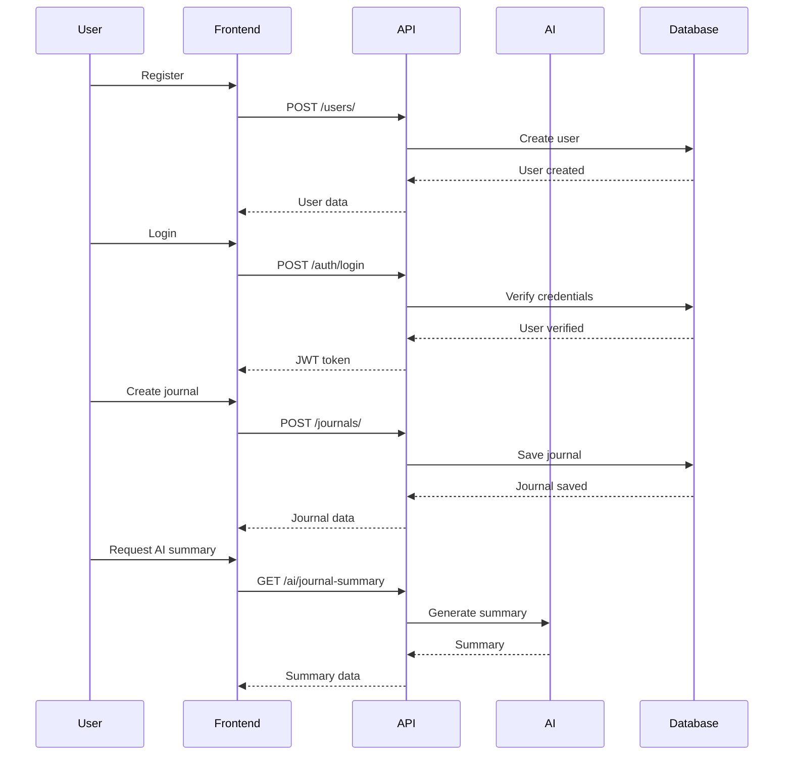
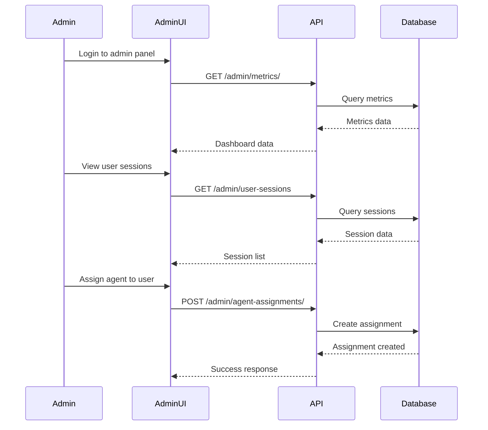

# Vida Coach API Documentation

## Table of Contents
1. [Overview](#overview)
2. [Getting Started](#getting-started)
3. [Authentication](#authentication)
4. [API Route Structure](#api-route-structure)
5. [Core User Routes](#core-user-routes)
6. [Authentication Routes](#authentication-routes)
7. [Journal Management](#journal-management)
8. [AI & Coaching](#ai--coaching)
9. [Goals & Tasks](#goals--tasks)
10. [Health & Wellness](#health--wellness)
11. [Account Management](#account-management)
12. [Admin Routes](#admin-routes)
13. [System Routes](#system-routes)
14. [Error Handling](#error-handling)
15. [Rate Limiting](#rate-limiting)
16. [Testing & Development](#testing--development)

## Overview

The Vida Coach API is a comprehensive backend system for a personal coaching and wellness application. It provides endpoints for user management, journaling, AI-powered coaching, goal tracking, health monitoring, and administrative functions.

**Base URL:** `http://localhost:8003` (Development)
**API Version:** 1.0.0
**Contact:** support@vidacoach.ai

## Getting Started

### Prerequisites
- Python 3.11+
- SQLite (for development)
- Required environment variables

### Environment Setup
```bash
# Required environment variables
DATABASE_URL="sqlite:///./test.db"
OPENAI_API_KEY="your_openai_key"
STRIPE_SECRET_KEY="sk_test_..."
STRIPE_WEBHOOK_SECRET="whsec_..."
SECRET_KEY="your_secret_key"
RATE_LIMIT="100/minute"
TESTING="true"  # For development
```

### Starting the Application
```bash
# Activate virtual environment
source venv/bin/activate

# Start the server
uvicorn main:app --reload --host 0.0.0.0 --port 8003
```

### Interactive Documentation
- **Swagger UI:** http://localhost:8003/docs
- **ReDoc:** http://localhost:8003/redoc
- **OpenAPI Schema:** http://localhost:8003/openapi.json

## Authentication

The API uses JWT (JSON Web Tokens) for authentication. Most endpoints require authentication via the `Authorization` header.

### Authentication Flow


### Headers
```http
Authorization: Bearer <your_jwt_token>
Content-Type: application/json
```

## API Route Structure

```mermaid
graph TD
    A[Vida Coach API] --> B[Authentication]
    A --> C[User Management]
    A --> D[Journal Management]
    A --> E[AI & Coaching]
    A --> F[Goals & Tasks]
    A --> G[Health & Wellness]
    A --> H[Account Management]
    A --> I[Admin Routes]
    A --> J[System Routes]
    
    B --> B1[POST /auth/login]
    B --> B2[POST /auth/logout]
    
    C --> C1[POST /users/]
    C --> C2[GET /users/{user_id}]
    
    D --> D1[POST /journals/]
    D --> D2[GET /journals/{entry_id}]
    D --> D3[GET /journals/export]
    D --> D4[GET /journals/analyze-tags]
    
    E --> E1[POST /ai/coach]
    E --> E2[POST /ai/orchestrate]
    E --> E3[GET /ai/journal-summary]
    E --> E4[GET /ai/progress-report]
    
    F --> F1[POST /goals/]
    F --> F2[GET /goals/{goal_id}]
    F --> F3[POST /tasks/]
    F --> F4[PUT /tasks/{task_id}/complete]
    
    G --> G1[POST /habit-sync/sync]
    G --> G2[GET /habit-sync/recent]
    G --> G3[POST /user/wearables/]
    
    H --> H1[GET /account/]
    H --> H2[DELETE /account/delete]
    H --> H3[POST /account/assign_agent]
    
    I --> I1[GET /admin/metrics/]
    I --> I2[GET /admin/revenue/summary]
    I --> I3[GET /admin/agents/]
    
    J --> J1[GET /health/ping]
    J --> J2[GET /health/version]
    J --> J3[POST /analytics/event]
```

## Core User Routes

### User Management
| Method | Endpoint | Description | Auth Required |
|--------|----------|-------------|---------------|
| POST | `/users/` | Create new user | No |
| GET | `/users/{user_id}` | Get user by ID | Yes |

### User Creation Example
```bash
curl -X POST "http://localhost:8003/users/" \
  -H "Content-Type: application/json" \
  -d '{
    "email": "user@example.com",
    "hashed_password": "hashed_password_here",
    "full_name": "John Doe",
    "age": 30,
    "sex": "male"
  }'
```

## Authentication Routes

### Login
```bash
curl -X POST "http://localhost:8003/auth/login" \
  -H "Content-Type: application/json" \
  -d '{
    "username": "user@example.com",
    "password": "password123"
  }'
```

**Response:**
```json
{
  "access_token": "eyJ0eXAiOiJKV1QiLCJhbGciOiJIUzI1NiJ9...",
  "token_type": "bearer"
}
```

### Logout
```bash
curl -X POST "http://localhost:8003/auth/logout" \
  -H "Authorization: Bearer <your_token>"
```

## Journal Management

### Create Journal Entry
```bash
curl -X POST "http://localhost:8003/journals/" \
  -H "Authorization: Bearer <your_token>" \
  -H "Content-Type: application/json" \
  -d '{
    "user_id": 1,
    "title": "Daily Reflection",
    "content": "Today was productive...",
    "linked_goal_id": 1
  }'
```

### Get Journal Entry
```bash
curl -X GET "http://localhost:8003/journals/1" \
  -H "Authorization: Bearer <your_token>"
```

### Export Journals
```bash
curl -X GET "http://localhost:8003/journals/export" \
  -H "Authorization: Bearer <your_token>"
```

### Analyze Journal Tags
```bash
curl -X GET "http://localhost:8003/journals/analyze-tags" \
  -H "Authorization: Bearer <your_token>"
```

## AI & Coaching

### AI Coach
```bash
curl -X POST "http://localhost:8003/ai/coach" \
  -H "Authorization: Bearer <your_token>" \
  -H "Content-Type: application/json" \
  -d '{
    "prompt": "Help me with my fitness goals",
    "context": "User context here"
  }'
```

### Orchestrate AI Request
```bash
curl -X POST "http://localhost:8003/ai/orchestrate" \
  -H "Authorization: Bearer <your_token>" \
  -H "Content-Type: application/json" \
  -d '{
    "user_prompt": "I need help with stress management",
    "user_id": 1
  }'
```

### Get Journal Summary
```bash
curl -X GET "http://localhost:8003/ai/journal-summary" \
  -H "Authorization: Bearer <your_token>"
```

### Get Progress Report
```bash
curl -X GET "http://localhost:8003/ai/progress-report" \
  -H "Authorization: Bearer <your_token>"
```

## Goals & Tasks

### Create Goal
```bash
curl -X POST "http://localhost:8003/goals/" \
  -H "Authorization: Bearer <your_token>" \
  -H "Content-Type: application/json" \
  -d '{
    "user_id": 1,
    "title": "Run a Marathon",
    "description": "Complete a full marathon by end of year"
  }'
```

### Get Goal
```bash
curl -X GET "http://localhost:8003/goals/1" \
  -H "Authorization: Bearer <your_token>"
```

### Create Task
```bash
curl -X POST "http://localhost:8003/tasks/" \
  -H "Authorization: Bearer <your_token>" \
  -H "Content-Type: application/json" \
  -d '{
    "user_id": 1,
    "description": "Run 5 miles today",
    "due_date": "2024-01-15T18:00:00"
  }'
```

### Complete Task
```bash
curl -X PUT "http://localhost:8003/tasks/1/complete" \
  -H "Authorization: Bearer <your_token>"
```

## Health & Wellness

### Habit Sync
```bash
curl -X POST "http://localhost:8003/habit-sync/sync?source=fitbit" \
  -H "Authorization: Bearer <your_token>"
```

### Get Recent Habits
```bash
curl -X GET "http://localhost:8003/habit-sync/recent?days=7" \
  -H "Authorization: Bearer <your_token>"
```

### Push Wearable Data
```bash
curl -X POST "http://localhost:8003/user/wearables/" \
  -H "Authorization: Bearer <your_token>" \
  -H "Content-Type: application/json" \
  -d '{
    "data_type": "steps",
    "value": 8500,
    "timestamp": "2024-01-15T12:00:00Z"
  }'
```

## Account Management

### Get Account Info
```bash
curl -X GET "http://localhost:8003/account/" \
  -H "Authorization: Bearer <your_token>"
```

### Assign Agent
```bash
curl -X POST "http://localhost:8003/account/assign_agent" \
  -H "Authorization: Bearer <your_token>" \
  -H "Content-Type: application/json" \
  -d '{
    "domain": "fitness"
  }'
```

### Delete Account
```bash
curl -X DELETE "http://localhost:8003/account/delete" \
  -H "Authorization: Bearer <your_token>"
```

## Admin Routes

### System Metrics
```bash
curl -X GET "http://localhost:8003/admin/metrics/" \
  -H "Authorization: Bearer <admin_token>"
```

### Revenue Summary
```bash
curl -X GET "http://localhost:8003/admin/revenue/summary" \
  -H "Authorization: Bearer <admin_token>"
```

### Agent Management
```bash
curl -X GET "http://localhost:8003/admin/agents/" \
  -H "Authorization: Bearer <admin_token>"
```

### User Sessions
```bash
curl -X GET "http://localhost:8003/admin/user-sessions?limit=100" \
  -H "Authorization: Bearer <admin_token>"
```

### Audit Logs
```bash
curl -X GET "http://localhost:8003/admin/audit-logs?limit=100&offset=0" \
  -H "Authorization: Bearer <admin_token>"
```

## System Routes

### Health Check
```bash
curl -X GET "http://localhost:8003/health/ping"
```

**Response:**
```json
{
  "status": "ok"
}
```

### Get Version
```bash
curl -X GET "http://localhost:8003/health/version"
```

### Submit Analytics Event
```bash
curl -X POST "http://localhost:8003/analytics/event" \
  -H "Content-Type: application/json" \
  -d '{
    "event_type": "user_login",
    "event_payload": {
      "user_id": 1,
      "platform": "web"
    }
  }'
```

## Error Handling

### HTTP Status Codes
- `200` - Success
- `201` - Created
- `204` - No Content
- `400` - Bad Request
- `401` - Unauthorized
- `404` - Not Found
- `422` - Validation Error
- `500` - Internal Server Error

### Error Response Format
```json
{
  "detail": [
    {
      "loc": ["body", "email"],
      "msg": "field required",
      "type": "value_error.missing"
    }
  ]
}
```

## Rate Limiting

The API implements rate limiting to prevent abuse:
- **Default Limit:** 100 requests per minute
- **Configurable:** Via `RATE_LIMIT` environment variable
- **Headers:** Rate limit information included in response headers

### Rate Limit Headers
```
X-RateLimit-Limit: 100
X-RateLimit-Remaining: 95
X-RateLimit-Reset: 1642248000
```

## Testing & Development

### Running Tests
```bash
# Run all tests
TESTING=true python -m pytest -v

# Run specific test file
TESTING=true python -m pytest tests/test_auth.py -v

# Run with coverage
TESTING=true python -m pytest --cov=. --cov-report=html
```

### Test Environment
- Tests use SQLite in-memory database
- Rate limiter is disabled during tests
- Mock API keys are used

### Development Tips
1. **Hot Reload:** The server runs with `--reload` for development
2. **Environment Variables:** Use `.env` file for local development
3. **Database:** SQLite for development, PostgreSQL for production
4. **Logging:** Check console output for detailed logs

### Common Development Commands
```bash
# Start development server
uvicorn main:app --reload --host 0.0.0.0 --port 8003

# Run database migrations
alembic upgrade head

# Create new migration
alembic revision --autogenerate -m "description"

# Format code
black .

# Lint code
flake8 .
```

## API Flow Examples

### Complete User Journey


### Admin Workflow


## Security Considerations

1. **JWT Tokens:** Use secure, short-lived tokens
2. **Rate Limiting:** Prevents abuse and DDoS attacks
3. **Input Validation:** All inputs are validated using Pydantic
4. **SQL Injection:** Protected by SQLAlchemy ORM
5. **CORS:** Configure appropriately for your frontend domain

## Performance Optimization

1. **Database Indexing:** Ensure proper indexes on frequently queried fields
2. **Caching:** Consider Redis for session storage and caching
3. **Connection Pooling:** Configure database connection pools
4. **Async Operations:** Use async/await for I/O operations
5. **Pagination:** Implement pagination for large datasets

## Monitoring & Logging

### Health Checks
- `/health/ping` - Basic health check
- `/health/version` - Application version

### Analytics
- `/analytics/event` - Track user events
- Admin dashboard for metrics

### Logging
- Structured logging with timestamps
- Different log levels (DEBUG, INFO, WARNING, ERROR)
- Request/response logging for debugging

## Support & Documentation

- **API Documentation:** http://localhost:8003/docs
- **Contact:** support@vidacoach.ai
- **GitHub:** Repository for issues and contributions
- **Testing:** Comprehensive test suite included

---

*This documentation is generated from the actual running Vida Coach API. For the most up-to-date information, always refer to the interactive API documentation at `/docs`.* 